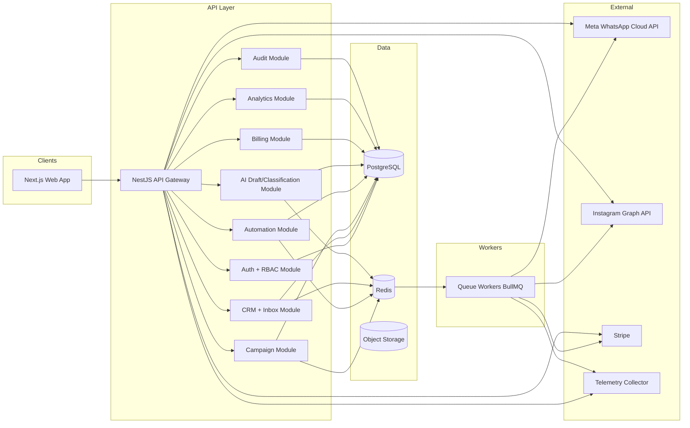
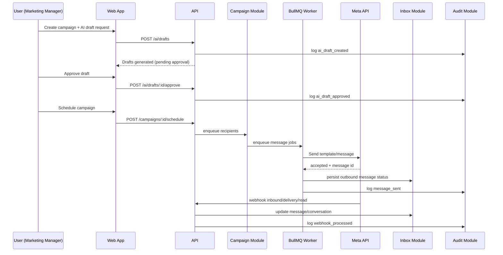

# Architecture Plan (Pre-Code Approval)

## 1) System Architecture Diagram

## 2) Service Interaction Diagram

## 3) Database Schema Proposal

- `public` schema (control plane):
  - tenants
  - workspaces
  - users
  - workspace_users
  - billing_subscriptions
  - billing_usage
  - audit_logs
  - integration_credentials
- Per-tenant schema (`tenant_<id>`):
  - whatsapp_accounts
  - contacts
  - consent_logs
  - tags
  - contact_tags
  - conversations
  - messages
  - templates
  - campaigns
  - campaign_runs
  - campaign_recipients
  - ai_content_drafts
  - automation_flows
  - automation_runs
  - pipelines
  - pipeline_stages
  - deals
  - lead_classifications
  - review_requests

### Isolation Model
- Each request resolves `tenant_id` from auth token + workspace context.
- PostgreSQL `search_path` switched per request/worker job to tenant schema.
- Control plane data remains in `public` schema.

## 4) API Endpoint Structure

### Auth / Tenancy
- `POST /auth/login`
- `POST /auth/refresh`
- `GET /me`
- `GET /workspaces`
- `POST /workspaces/:id/switch`

### Contacts / Consent
- `POST /contacts`
- `GET /contacts`
- `PATCH /contacts/:id`
- `POST /contacts/:id/consents`
- `POST /contacts/:id/opt-out`

### Inbox
- `GET /inbox/conversations`
- `GET /inbox/conversations/:id/messages`
- `POST /inbox/conversations/:id/assign`
- `POST /inbox/conversations/:id/close`
- `POST /inbox/conversations/:id/notes`

### WhatsApp / Instagram Webhooks
- `GET /webhooks/meta/verify`
- `POST /webhooks/meta/messages`
- `POST /webhooks/instagram/messages`

### Campaigns
- `POST /campaigns`
- `POST /campaigns/:id/schedule`
- `POST /campaigns/:id/pause`
- `POST /campaigns/:id/resume`
- `GET /campaigns/:id/metrics`

### AI Studio
- `POST /ai/drafts`
- `POST /ai/drafts/:id/approve`
- `POST /ai/classify-message`

### Automations
- `POST /automations/flows`
- `POST /automations/flows/:id/activate`
- `GET /automations/runs`

### Pipeline / Deals
- `GET /pipelines`
- `POST /deals`
- `PATCH /deals/:id/stage`

### Billing
- `POST /billing/checkout`
- `POST /billing/portal`
- `POST /webhooks/stripe`

### GDPR
- `POST /privacy/export`
- `POST /privacy/delete`
- `POST /privacy/retention/run`

### Audit
- `GET /audit-logs`

## 5) Module Breakdown (NestJS)

- `AuthModule` (JWT, sessions, RBAC guards)
- `TenancyModule` (tenant resolver, schema routing)
- `UsersModule`
- `WorkspaceModule`
- `IntegrationModule` (Meta/Instagram credentials encrypted)
- `ContactsModule`
- `ConsentModule`
- `InboxModule`
- `CampaignModule`
- `TemplateModule`
- `AutomationModule`
- `AiStudioModule`
- `LeadClassificationModule`
- `PipelineModule`
- `AnalyticsModule`
- `BillingModule`
- `PrivacyModule`
- `AuditModule`
- `QueueModule` (BullMQ producers/consumers)
- `ObservabilityModule`

## 6) Development Phases

1. Foundation
- Monorepo, strict TS, auth, tenancy, RBAC, audit baseline.

2. Messaging Core
- WhatsApp webhook/send, contacts, consent, inbox, assignment.

3. Campaign Engine
- Campaign scheduling, queue sending, delivery tracking, rate limiting.

4. AI & Approval
- AI drafts + mandatory human approval + classification.

5. CRM Growth
- Pipeline/deals, automations, analytics dashboards.

6. Billing & Governance
- Stripe plans, usage enforcement, GDPR export/delete/retention.

7. Multi-channel
- Instagram DM + unified inbox.

8. Optimization
- send-time recommendations, A/B winner automation, SRE hardening.

## 7) Risk Analysis

- Meta API policy violations
  - Mitigation: policy checks + template validation + approval gates.
- Cross-tenant data leakage
  - Mitigation: schema isolation + tenancy middleware + tests.
- Queue overload / delivery spikes
  - Mitigation: per-tenant throttling + backoff + dead-letter queues.
- AI unsafe output
  - Mitigation: moderation + human approval required + audit trail.
- GDPR non-compliance
  - Mitigation: consent logs, DSR endpoints, retention jobs.
- Webhook replay or spoofing
  - Mitigation: signature verification + idempotency keys.

## 8) Compliance Checklist

- [ ] Explicit consent capture with versioned text
- [ ] Opt-out keyword handling (STOP/UNSUBSCRIBE/CANCEL)
- [ ] Consent proof and source stored
- [ ] DSR export endpoint
- [ ] DSR deletion endpoint
- [ ] Data retention job and policy
- [ ] Audit log for personal data operations
- [ ] Role-based access control
- [ ] Encrypted integration credentials
- [ ] Webhook signature validation
- [ ] Human approval required for AI campaign content
- [ ] Rate limiting and abuse prevention

## 9) Initial Industry AI Context (seed)

Seed categories:
- sofa cleaning
- mattress cleaning
- car interior cleaning
- carpet washing
- upholstery waterproofing
- ozone odor removal

Tone defaults:
- professional
- concise
- non-spam
- optional emoji
- personalization with `{{first_name}}`

---
Status: Ready for architecture approval before coding feature implementation.
